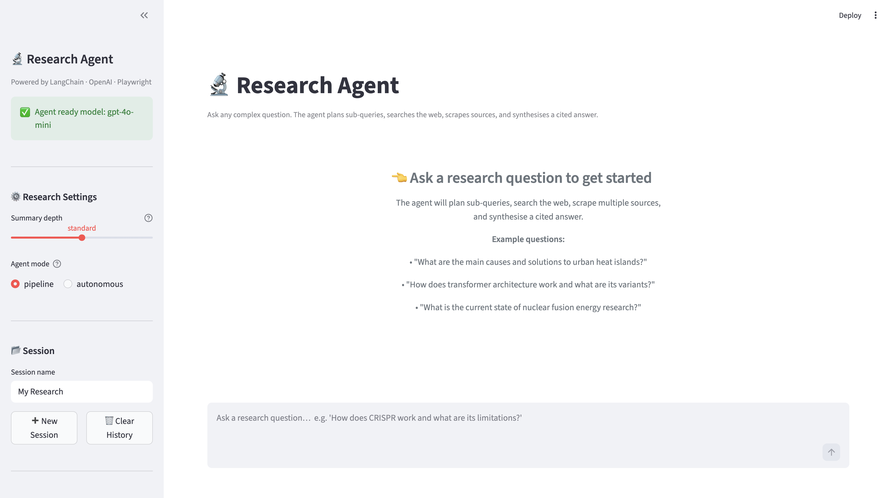

# AI Research Agent

A modular AI research agent that autonomously plans sub-queries, searches the web, scrapes multiple sources, extracts key facts, and synthesises a cited answer to complex questions. Built with LangChain, OpenAI, Playwright, and DuckDuckGo.

---

## Problem Statement

Manually researching a complex topic requires iterating across multiple search queries, reading and filtering pages, and synthesising information from diverse sources — a process that is time-consuming and prone to cognitive bias. This project automates that workflow using an LLM-guided planning and retrieval loop, producing a structured, cited answer from live web sources with minimal human input.

---

## Solution Approach

The user submits a research question and a depth level. A query planner uses GPT to decompose the question into two to four focused sub-queries. Each sub-query is executed against a web search provider. The top-ranked URLs are scraped concurrently using Playwright, cleaned with BeautifulSoup, and summarised per page. All summaries are fed to GPT in a single grounded prompt which produces a cohesive answer with inline citations. Every step is logged to a JSON file and persisted to SQLite.

---

## Features

- **LLM-powered query planning** — GPT decomposes complex questions into prioritised sub-queries
- **Adaptive re-planning** — if fewer than three results are returned, the planner generates additional sub-queries automatically
- **Multi-provider web search** — DuckDuckGo (free, no key), Tavily, or SerpAPI; configurable via `.env`
- **Playwright-based scraping** — renders JavaScript-heavy pages before extraction
- **Multi-extractor content pipeline** — BeautifulSoup, readability-lxml, trafilatura, and newspaper4k applied in order
- **Three summarisation levels** — brief, standard, detailed; user-selectable per query
- **Grounded synthesis** — all sources are passed to GPT in a single prompt with `[Source N]` inline citations and Key Takeaways
- **Confidence scoring** — computed from source relevance scores across retrieved pages
- **Two agent modes** — Pipeline (fixed, reproducible) and Autonomous (LangChain tools agent)
- **Session management** — persistent sessions with multi-query chat context
- **Structured logging** — per-run JSON step logs in `logs/` and SQLite persistence in `data/research.db`
- **Streamlit frontend** — question input, depth selector, live step trace, and expandable source cards

---

## Tech Stack

| Layer | Technology |
|---|---|
| LLM & Agent | OpenAI GPT-4o-mini via LangChain |
| Web search | DuckDuckGo (default) / Tavily / SerpAPI |
| Scraping | Playwright (async) + BeautifulSoup4 |
| Content extraction | readability-lxml, trafilatura, newspaper4k |
| Database | SQLite via SQLAlchemy Core |
| Configuration | Pydantic Settings |
| Frontend | Streamlit |
| Testing | pytest + pytest-asyncio |

---

## Architecture

```
STREAMLIT UI  (ui/app.py)
  question + depth level
        │
        ▼
ResearchOrchestrator  (agent/orchestrator.py)
        │
        ├── QueryPlanner  (agent/planner.py)
        │     GPT decomposes question → 2–4 sub-queries with priorities
        │
        ├── WebSearchTool  (agent/tools/search.py)
        │     DuckDuckGo / Tavily / SerpAPI per sub-query
        │     Results deduplicated by URL → ResearchMemory
        │
        ├── WebScraperTool  (agent/tools/scraper.py)
        │     Playwright renders JS → BS4 strips nav/ads
        │     readability-lxml extracts main article body
        │     Concurrent scraping of top-ranked URLs
        │
        ├── SummarisationTool  (agent/tools/summariser.py)
        │     Per-page summarisation at requested depth level
        │     Key fact extraction per source
        │
        └── Synthesis
              All summaries → GPT grounded prompt
              → cohesive answer + [Source N] citations + Key Takeaways
              → ResearchResult (answer, sources, confidence, steps)

PERSISTENCE LAYER
  logs/           — per-run JSON step logs (auto-created)
  data/research.db — SQLite session and result store (auto-created)
```

---

## Reasoning Flow

| Step | Module | What Happens |
|---|---|---|
| 1. Plan | `planner.py` | GPT returns 2–4 sub-queries with rationale |
| 2. Search | `tools/search.py` | Each sub-query executed; results deduplicated by URL |
| 3. Scrape | `tools/scraper.py` | Top URLs scraped concurrently; main body extracted |
| 4. Summarise | `tools/summariser.py` | Each page summarised; key facts extracted |
| 5. Synthesise | `orchestrator.py` | GPT writes cohesive answer with inline citations |
| 6. Log | `logger.py` + `database.py` | Step timings written to JSON and SQLite |

---

## Project Structure

```
Research Agent/
├── agent/
│   ├── __init__.py
│   ├── config.py          # Pydantic settings from .env
│   ├── models.py          # All Pydantic schemas
│   ├── logger.py          # Step logger — console and JSON file
│   ├── planner.py         # Query decomposition (GPT JSON output)
│   ├── memory.py          # Per-query ResearchMemory and SessionStore
│   ├── database.py        # SQLite via SQLAlchemy Core
│   ├── orchestrator.py    # Main pipeline and autonomous agent mode
│   └── tools/
│       ├── __init__.py
│       ├── search.py      # DuckDuckGo / Tavily / SerpAPI
│       ├── scraper.py     # Playwright + BeautifulSoup + readability
│       └── summariser.py  # Multi-level summarise and synthesise
├── ui/
│   └── app.py             # Streamlit frontend
├── tests/
│   ├── __init__.py
│   ├── test_planner.py
│   ├── test_tools.py
│   └── test_orchestrator.py
├── data/                  # SQLite database (auto-created)
├── logs/                  # Per-run JSON step logs (auto-created)
├── requirements.txt
└── README.md
```

---

## Setup Instructions

### Prerequisites

- Python 3.10+
- An OpenAI API key
- Chromium (installed via Playwright post-install step)

### 1. Clone the repository

```bash
git clone <repo-url>
cd "Research Agent"
```

### 2. Create and activate a virtual environment

```bash
python -m venv venv
source venv/bin/activate        # Windows: venv\Scripts\activate
```

### 3. Install dependencies

```bash
pip install -r requirements.txt
playwright install chromium
```

### 4. Configure environment variables

Create a `.env` file in the project root:

```env
OPENAI_API_KEY=sk-...

# Optional — defaults shown
CHAT_MODEL=gpt-4o-mini
SEARCH_PROVIDER=duckduckgo
MAX_SEARCH_RESULTS=6
MAX_SCRAPE_PAGES=4
SCRAPE_TIMEOUT_MS=15000
MAX_SUB_QUERIES=4
DEFAULT_SUMMARY_LEVEL=standard
USE_PLAYWRIGHT=true

# Required only if using Tavily or SerpAPI
TAVILY_API_KEY=
SERPAPI_KEY=
```

---

## How to Run

### Launch the Streamlit UI

```bash
streamlit run ui/app.py
```

Open [http://localhost:8501](http://localhost:8501), enter a research question, select a depth level, and click **Research**.

### Run tests

```bash
pytest tests/ -v
```

---

## Example Usage

**Programmatic — single question:**

```python
from agent.orchestrator import ResearchOrchestrator

orch = ResearchOrchestrator()

result = orch.research(
    question="How does CRISPR gene editing work and what are its current limitations?",
    level="detailed",
)

print(result.answer)
print(f"\nConfidence: {result.confidence:.0%}")
for src in result.sources:
    print(f"  [{src.relevance_score:.0%}] {src.title} — {src.url}")
```

**Programmatic — persistent session:**

```python
session_id = orch.create_session(name="AI Safety Research")

r1 = orch.research("What is AI alignment?", session_id=session_id)
r2 = orch.research("What are the main proposed solutions?", session_id=session_id)

history = orch.get_session_history(session_id)
```

---

## Configuration Reference

| Variable | Default | Description |
|---|---|---|
| `OPENAI_API_KEY` | — | **Required.** OpenAI API key |
| `CHAT_MODEL` | `gpt-4o-mini` | LLM for planning, summarisation, synthesis |
| `SEARCH_PROVIDER` | `duckduckgo` | `duckduckgo` \| `tavily` \| `serpapi` |
| `MAX_SEARCH_RESULTS` | `6` | Results fetched per sub-query |
| `MAX_SCRAPE_PAGES` | `4` | Pages scraped per research run |
| `SCRAPE_TIMEOUT_MS` | `15000` | Playwright page-load timeout |
| `MAX_SUB_QUERIES` | `4` | Maximum sub-queries the planner generates |
| `DEFAULT_SUMMARY_LEVEL` | `standard` | `brief` \| `standard` \| `detailed` |
| `USE_PLAYWRIGHT` | `true` | Use Playwright for JavaScript-rendered pages |

---

## Agent Modes

**Pipeline mode (default)** executes a fixed, reproducible sequence of steps. Every action is visible in the structured step trace. Best for production use and debugging.

**Autonomous mode** uses LangChain's `create_openai_tools_agent` to let the LLM decide which tools to invoke, in what order, and when to stop. Better suited to unusual or highly open-ended queries. Falls back to pipeline mode on error.

---

## Key Engineering Decisions

**Multi-extractor content pipeline** applies readability-lxml, trafilatura, and newspaper4k in sequence, falling back along the chain when the primary extractor returns insufficient content. This significantly improves extraction quality across diverse site layouts compared to BeautifulSoup alone.

**Adaptive re-planning** detects when a search provider returns too few results and automatically generates additional sub-queries. This prevents silent research gaps without requiring the user to rephrase their question.

**Concurrent scraping** via async Playwright reduces total scraping time from O(n × latency) to roughly O(max latency), which is important for a good user experience given typical web page load times of 2–5 seconds.

**Structured logging** to JSON at the step level enables offline inspection of the full reasoning trace, making it straightforward to debug failures or evaluate which steps contributed most to answer quality.

**SQLAlchemy Core** (rather than ORM) is used for database access because the schema is simple and the overhead of session management in the ORM is not justified for this use case.

---

## Limitations

- DuckDuckGo rate limits apply on free usage; switching to Tavily or SerpAPI is recommended for production or repeated use.
- Playwright-based scraping will fail on sites that block headless browsers or require authentication.
- The confidence score is heuristic (based on source relevance ranks) and not a calibrated probability.
- Scraping accuracy depends on the structure of each web page; unusual layouts may yield incomplete extraction.
- The system does not validate factual claims across sources; conflicting information from different pages is passed to the LLM without resolution.

---

## Future Work

- Add a FAISS semantic index over scraped content for chunk-level retrieval instead of full-page summarisation
- Implement cross-encoder re-ranking to score source relevance more precisely
- Wrap the orchestrator in a FastAPI service with WebSocket progress streaming
- Add per-user rate limiting and session isolation for multi-user deployment
- Support export of research results to Markdown or PDF

---

## Screenshots


---

## Author

**Samik Hafeez** — BSc Computer Science Portfolio Project  
This project demonstrates autonomous AI agent design, web-scale information retrieval, and grounded language model synthesis.
